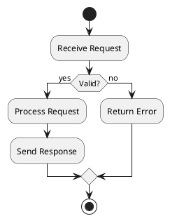
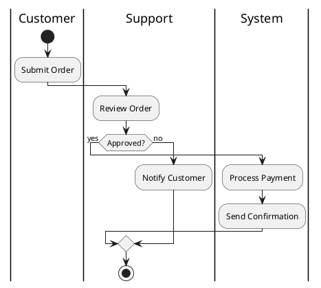
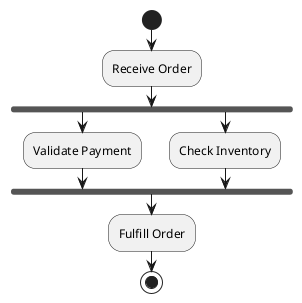

# Process Analysis

Map, analyze, and optimize business processes using flowcharts.

## Flowchart Elements

| Shape | PlantUML | Use |
|-------|----------|-----|
| Oval | `start` / `stop` | Terminal (Start/End) |
| Rectangle | `:Action;` | Process/Task |
| Diamond | `if (condition?) then (yes)` | Decision |
| Fork | `fork` / `fork again` / `end fork` | Parallel paths |
| Note | `note right: text` | Annotation |

## Basic Flowchart (PlantUML)



## Swimlane Flowchart (PlantUML)



## Parallel Processing



## Bottleneck Signs

- Work piling up before step
- Long wait times, resource at max
- Downstream idle time
- Frequent rework loops

## Optimization Techniques

**Eliminate**: Remove unnecessary steps
**Automate**: Replace manual with system
**Parallelize**: Run steps concurrently
**Simplify**: Reduce complexity
**Standardize**: Create consistent SOPs

## Process Template

```
Process: [Name]
Owner: [Role]
Trigger: [What starts it]
Output: [What it produces]
Steps: 1.[Actor]-[Action]-[Tool] 2.[Actor]-[Action]-[Tool]
Business Rules: [Condition→Action]
Exceptions: [Scenario→Handling]
```

## Root Cause Analysis

**5 Whys**: Ask "Why?" 5 times to find root cause

**Fishbone (Ishikawa)**:
```
People ──┐
Methods ─┼──→ [Problem]
Machine ─┤
Material ┘
```

## Tools

- **PlantUML**: Text-based diagrams, version control friendly
- **draw.io**: Free, web-based, exports to multiple formats
- **Lucidchart**: Collaborative, templates
- **Miro**: Whiteboard style, team collaboration
